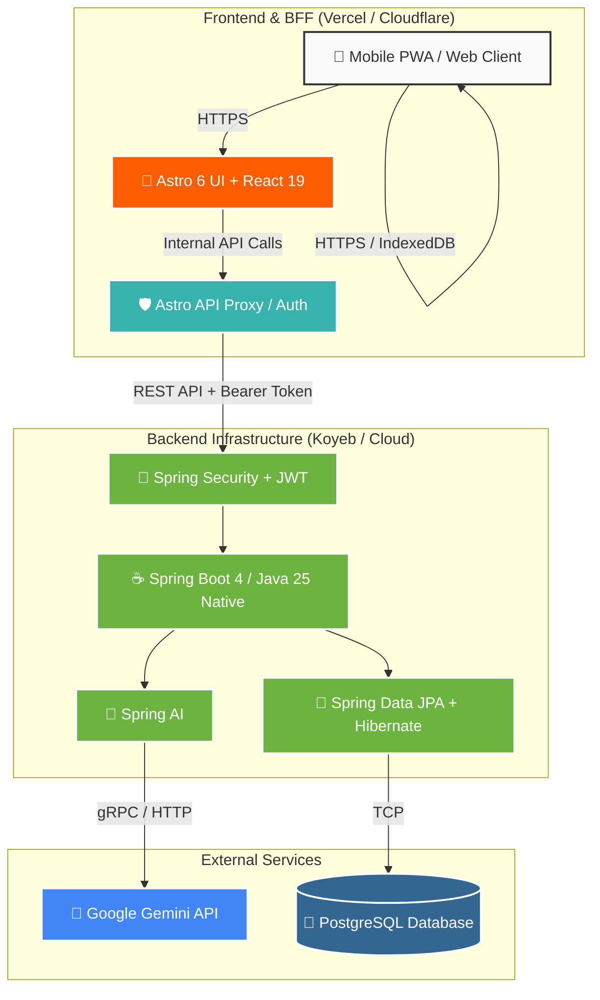
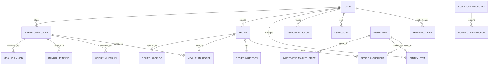

# Cacomi - Diagrams (Mermaid)

Este archivo contiene el código Mermaid generado a partir del análisis del backend en Java. Puedes copiar estos bloques y pegarlos en [Mermaid Live Editor](https://mermaid.live/) para exportarlos como `.svg` y reemplazar los archivos actuales (`db-schema.svg` y `architecture-diagram2.svg`) en tu portfolio.

## 1. Architecture Diagram

Este diagrama ilustra la arquitectura completa, destacando el rol del BFF y el backend en Java 25.



## 2. Database Schema (Entity-Relationship)

Este diagrama representa la estructura relacional extraída de las entidades JPA (`@Entity`) en tu backend.



### Instrucciones para exportar:
1. Ve a [Mermaid Live Editor](https://mermaid.live/).
2. Pega el código del bloque que quieras exportar (sin los backticks ````mermaid ````).
3. Ajusta el tema (Theme) en la configuración si quieres que se vea mejor (ej. cambiar a modo oscuro o claro).
4. Haz clic en el botón de **Download SVG** y guárdalo en la carpeta `src/assets/images/projects/smart-recipe/` de tu portfolio con los nombres correspondientes.
